# Best Practices for Building Research Experiment Code with Coding Agents

> A human–agent research-engineering workflow from research idea and protocol to test-driven implementation, scientific evidence, and claim approval

Version: 1.0

Audience: research students, research programmers, research engineers, PIs, experiment owners, and maintainers supervising coding agents

Scope: machine learning, recommender systems, NLP, computer vision, graph learning, reinforcement learning, data science, and other projects combining a research idea, experimental code, and scientific claims

[中文版](#zh-cn)

---

## 0. What this workflow solves

Coding agents can greatly accelerate repository reading, framework construction, module implementation, testing, debugging, experiment operations, and result preparation. Research projects nevertheless fail for reasons that ordinary compilation and smoke tests do not expose:

- the implemented problem drifts from the intended research question;
- a formula, loss, mask, index, reduction, or gradient path is subtly wrong;
- data splitting, sample identity, caching, or checkpoint handling violates an experimental boundary;
- baselines receive unequal information, tuning budgets, or stopping conditions;
- the test set or other protected evidence influences model selection;
- failed runs, negative results, or anomalous samples disappear from the record;
- the paper's claims exceed what the experiment actually supports;
- an agent changes data, models, metrics, budgets, or hypotheses without approval.

The efficient workflow is therefore not:

> A human provides a vague idea → an agent implements and optimizes freely → the human checks only the final metric.

It is:

> The human freezes the research question, scientific protocol, authority boundaries, and acceptance criteria; the agent performs high-bandwidth implementation, testing, and operations; mechanical checks continuously enforce invariants; and the human approves every change to scientific meaning and owns the final claim.

This document turns that division of responsibility into an operational workflow.

---

## 1. Core principles

### 1.1 The agent provides execution bandwidth; the human retains scientific control

An agent is well suited to:

- read papers, repositories, configurations, logs, and data documentation;
- translate a frozen specification into project structure, interfaces, and implementation;
- write unit, integration, property, gradient, and regression tests;
- run smoke tests, baselines, ablations, and approved searches;
- monitor jobs and recover interrupted runs;
- prepare tables, plots, and report drafts;
- repair ordinary engineering failures when the evidence is clear.

The human must control:

- the research question, target construct, and success criteria;
- data versions, independent units, splits, and leakage boundaries;
- the scientific definition of models, losses, metrics, baselines, and candidate sets;
- tuning budgets, stopping rules, checkpoint selection, and test-set use;
- which actions are automatic and which require prior approval;
- statistical procedures, practical-significance thresholds, and permitted claims;
- paper conclusions, causal interpretation, ethics, and release.

### 1.2 Freeze the protocol before asking the agent to write code

If the instruction is only “implement this idea and improve the metric,” the agent must silently fill in major scientific decisions. It may produce excellent code for a moving or incorrect problem.

Before production code is written, freeze at least:

1. the research question and primary hypotheses;
2. the data and independent unit;
3. training, validation, test, and protected-evidence boundaries;
4. the primary model and baseline conditions;
5. losses, metrics, and candidate sets;
6. tuning budgets and stopping rules;
7. repetition and statistical-analysis plans;
8. protected-evidence rules;
9. agent permissions, resource limits, and approval boundaries;
10. the strongest claim the planned evidence could support.

### 1.3 Passing tests is not the same as being scientifically correct

Tests prove only the rules encoded in those tests. A mistaken specification can produce a thoroughly tested but scientifically wrong system.

Every project therefore needs:

- **implementation tests** for interfaces, shapes, values, gradients, and state;
- **protocol tests** for data boundaries, evaluation order, budgets, and run completeness;
- **scientific review** for fairness, experimental units, statistics, and claim scope;
- **governance review** for approvals, permissions, failed-run retention, and protected evidence.

### 1.4 Every consequential statement must be traceable

Statements such as “the implementation is correct,” “the experiment is complete,” “the method is better,” or “this belongs in the paper” should trace to:

- a specification clause or paper location;
- code, configuration, and commit;
- data, environment, and dependency versions;
- test names and fresh test results;
- `run_id`, seed, and checkpoint;
- raw logs and experiment ledgers;
- aggregation code and statistical rules;
- exact evidence IDs cited by the claim;
- human approvals and decision records.

An untraceable result is a lead, not trusted evidence.

---

## 2. End-to-end workflow

```mermaid
flowchart LR
    subgraph S1["A · Definition and authority"]
        direction TB
        IDEA(["Research idea / reproduction objective"]) --> SPEC["Agent organizes the question, ambiguities, risks, and draft specification"]
        SPEC --> G0{"Gate 0<br/>Human freezes the question and success criteria"}
        G0 --> CONTRACT["Establish four contracts<br/>algorithm · pipeline · scientific evidence · governance"]
        CONTRACT --> G1{"Gate 1<br/>Approve data, metrics, baselines, budgets, and permissions"}
    end

    subgraph S2["B · Test-driven construction"]
        direction TB
        DESIGN["Agent designs architecture, data contracts, and acceptance tests<br/>retain valid RED first"] --> G2{"Gate 2<br/>Design and tests encode the frozen protocol"}
        G2 --> CODE["Agent implements bounded tasks<br/>RED → GREEN → regression"]
        CODE --> L12["Level 1 algorithm review<br/>Level 2 pipeline review"]
        L12 --> G34{"Gate 3 / 4<br/>Implementation and pipeline evidence pass"}
        G34 -- "Fail" --> REPAIR["Add a failing test + minimal repair"] --> CODE
    end

    subgraph S3["C · Controlled experiment execution"]
        direction TB
        G5{"Gate 5<br/>Run matrix and resources authorized"} --> RUN["Agent runs only approved baselines, ablations, seeds, and searches"]
        RUN --> LEDGER["Continuously record the run ledger, event log, resources, and failed runs"]
        LEDGER --> CHANGE{"Must data, model, loss, metric, budget, or hypothesis change?"}
        CHANGE -- "Yes" --> STOP["Stop adaptive work<br/>submit evidence and return to Gate 1"]
    end

    subgraph S4["D · Evidence and scientific claims"]
        direction TB
        EVID["Independently recompute aggregates, statistics, figures, and evidence IDs"] --> G6{"Gate 6<br/>Level 3 fairness, completeness, and statistical evidence"}
        G6 -- "Pass" --> GOV["Reconstruct approvals, resources, failed-run retention, and protected-evidence flow"]
        GOV --> G7{"Gate 7<br/>Level 4 governance and auditability"}
        G7 -- "Pass" --> CLAIM["Human Claim Gate<br/>approve conclusions, limits, negative results, and disclosures"]
        CLAIM --> RELEASE(["Reproducible code, experiment artifacts, and bounded scientific claims"])
        G6 -- "Fail" --> RERUN["Human returns to Gate 5 to rerun, weaken the claim, or terminate"]
        G7 -- "Fail" --> BLOCK["Block release<br/>preserve evidence and record the governance event"]
    end

    G1 --> DESIGN
    G34 -- "Pass" --> G5
    CHANGE -- "No" --> EVID

    classDef human fill:#fef3c7,stroke:#d97706,color:#451a03,stroke-width:2px;
    classDef agent fill:#dbeafe,stroke:#2563eb,color:#172554,stroke-width:2px;
    classDef evidence fill:#dcfce7,stroke:#16a34a,color:#052e16,stroke-width:2px;
    classDef stop fill:#fee2e2,stroke:#dc2626,color:#450a0a,stroke-width:2px;

    class G0,G1,G2,G34,G5,G6,G7,CLAIM human;
    class SPEC,DESIGN,CODE,REPAIR,RUN,RERUN agent;
    class CONTRACT,L12,LEDGER,EVID,GOV evidence;
    class STOP,BLOCK stop;
```



The gates are the most important components of the diagram. The agent may operate efficiently between gates, but it may not remove a gate or rewrite its scientific rules merely because results are disappointing.

---

## 3. Four contracts for auditing agent-written research code

Maintain four contracts throughout the project. Classify a failure by the first contract it violates, not by the severity of its downstream consequences.

| Level | Contract | Central question | Preferred evidence |
|---|---|---|---|
| Level 1 | Formulas, operators, indices, masks, losses, gradients | Does the local algorithm faithfully implement the mathematical definition? | Minimal tensor, property test, finite difference, gradient probe |
| Level 2 | Identity, splits, caches, state, checkpoints, evaluation | Does the automated pipeline preserve identity, state, and protected boundaries? | Data lineage, joint fingerprints, event order, independent recomputation |
| Level 3 | Baselines, information, budgets, experimental units, statistics, claims | Is the comparison fair, and does complete evidence support the claim? | Planned matrix, run ledger, configuration signatures, frozen analysis rule |
| Level 4 | Permissions, approvals, resources, stopping, records, protected evidence | Were agent actions authorized and fully auditable? | Frozen protocol, approval chain, event log, ledger and report reconstruction |

### 3.1 Level 1: algorithm semantics

Human review should examine:

- how every symbol maps to a tensor;
- shapes, axes, broadcasting, and reductions;
- masks for padding, invalid positions, and future information;
- whether a loss expects logits, probabilities, or another representation;
- label, item-ID, special-token, and offset spaces;
- `.detach()`, frozen parameters, in-place operations, and optimizer omissions;
- train/eval behavior that changes mathematical meaning.

The agent should deliver:

- a formula-to-code map;
- shape, axis, mask, target, loss, and gradient contracts;
- tiny hand-computable examples;
- property and gradient tests;
- evidence for every non-obvious implementation choice.

### 3.2 Level 2: pipeline integrity

Human review should examine:

- whether splitting occurs on the raw independent unit before augmentation or windowing;
- whether modalities, features, labels, masks, and IDs are permuted jointly;
- whether caches bind to the correct data version, configuration, and split;
- whether resume restores optimizer, scheduler, epoch, and random state;
- whether checkpoint selection uses only approved validation evidence;
- whether misses, failures, and empty cases remain in metric denominators;
- whether protected evaluation occurs only after selection and does not feed back into development.

The agent should deliver:

- data and sample identity manifests;
- lineage from raw entities to derived samples;
- joint fingerprints before and after batching or permutation;
- per-epoch training and validation state;
- checkpoint-selection evidence;
- one record per evaluation example, including zero-valued and failed cases;
- an ordered event log.

### 3.3 Level 3: scientific validity

Human review should examine:

- whether baselines use equal data, features, candidate populations, and external information;
- whether tuning trials, compute, early stopping, and engineering attention are comparable;
- whether failed and negative runs remain in the planned population and observed ledger;
- whether exclusions were frozen in advance;
- whether seeds, epochs, checkpoints, windows, or crops are incorrectly treated as independent scientific samples;
- whether pairing and statistical analysis are correct;
- whether effect sizes, uncertainty, practical thresholds, and multiple comparisons are addressed;
- whether claims exceed the datasets, tasks, metrics, and conditions tested.

The agent should deliver four separate evidence layers:

1. `planned_runs`: the complete population frozen before execution;
2. `runs`: every observed run, status, result, inclusion decision, and exclusion reason;
3. `aggregate`: exact recomputation from the declared included rows;
4. `claim`: scope, threshold, statistical result, and exact evidence run IDs.

### 3.4 Level 4: experiment governance

Human review should examine:

- whether approval existed before each adaptive change;
- whether approval status, time, scope, and limits covered the action;
- whether runs, time, GPU, API, or storage exceeded approved budgets;
- whether failed, cancelled, or negative results were deleted or hidden;
- whether protected evidence flowed into later adaptive action;
- whether all subagents used the same frozen protocol;
- whether the agent stopped and requested approval at material ambiguity.

The agent should deliver:

- a machine-readable frozen protocol with stable clause IDs;
- a time-ordered agent event log;
- approval status, scope, limits, and decision time;
- a complete run and resource ledger;
- a report manifest rebuilt from the ledger;
- explicit references tracing protected evidence into later actions.

---

## 4. Division of responsibility

| Activity | Agent may execute | Requires prior human approval | Human final decision |
|---|---|---|---|
| Requirements | Identify ambiguity and draft a specification | Research question and success criteria | Whether the idea is worth studying |
| Architecture | Propose modules, interfaces, directories, and tests | Data contracts and scientific boundaries | Whether the system represents the right problem |
| Data code | Implement download, parsing, cleaning, and caching | Data version, split unit, exclusion rules | Legality, ethics, and leakage boundary |
| Model code | Implement modules, forward pass, loss, and tests | Primary structure, objective, and assumptions | Whether mathematics matches research intent |
| Debugging | Repair failures with clear implementation evidence | Repairs that change scientific meaning | Whether protocol deviation is acceptable |
| Experiments | Run approved matrices, resume, and log | Search space, budget, and stopping | Whether to expand the experiment |
| Checkpoints | Save, restore, and batch-evaluate | Selection rule and evidence role | Which model may enter final evaluation |
| Analysis | Recompute, plot, and draft reports | Aggregation and statistical rule | Interpretation |
| Writing | Draft prose and tables | Claim scope | Innovation, causality, and final conclusion |
| Agent coordination | Decompose independent read and test tasks | Write access, paths, and shared protocol | Whether autonomous scope expansion is allowed |

### 4.1 Actions normally safe to automate

Within a frozen specification, an agent can usually:

- add or modify implementation code;
- add tests, types, logs, and diagnostics;
- fix ordinary bugs proven by failing tests;
- perform behavior-preserving refactoring;
- run approved smoke tests and bounded debugging;
- execute, resume, and summarize runs in the approved matrix;
- prepare figures and text that do not assert final scientific judgment.

### 4.2 Changes requiring prior approval

Approval must precede changes to:

- data sources, cleaning, label definitions, or splits;
- sample construction, negative sampling, candidate sets, or filtering;
- model architecture, primary loss, optimization objective, or training task;
- baseline information, pretrained resources, or tuning budgets;
- metrics, denominators, aggregation units, or statistical methods;
- checkpoint, early-stopping, or test-set rules;
- search ranges, seed counts, GPU/API/time budgets;
- removal of anomalous samples, failed runs, or negative results;
- primary hypotheses or research questions in response to poor results.

### 4.3 Default prohibitions

- using final test results for model or hyperparameter selection;
- feeding protected metrics into later adaptive development;
- silently changing the frozen protocol;
- overwriting raw logs, configurations, checkpoints, or results;
- retaining only the best seed, epoch, checkpoint, or run;
- deleting failed, cancelled, or negative runs;
- accessing unapproved files, data, networks, or services;
- interpreting absent approval as approval;
- turning generated tables directly into causal or universal claims.

---

## 5. Recommended project artifacts

A research project designed for human–agent collaboration should contain an auditable structure similar to:

```text
research-project/
├── README.md
├── GOVERNANCE/
│   ├── RESEARCH_SPEC.md
│   ├── FROZEN_PROTOCOL.yaml
│   ├── APPROVALS.jsonl
│   ├── DECISION_LOG.md
│   └── RISK_REGISTER.md
├── DESIGN/
│   ├── ARCHITECTURE.md
│   ├── PAPER_TO_CODE_MAP.md
│   ├── DATA_CONTRACT.md
│   ├── TENSOR_CONTRACT.md
│   └── ACCEPTANCE_CRITERIA.md
├── src/
├── tests/
│   ├── unit/
│   ├── properties/
│   ├── gradients/
│   ├── integration/
│   └── protocol/
├── experiments/
│   ├── planned_runs.csv
│   ├── configs/
│   ├── run_ledger.csv
│   ├── events.jsonl
│   └── raw_results/
├── analysis/
│   ├── aggregate.py
│   ├── aggregate.csv
│   ├── claims.json
│   └── figures/
├── reports/
│   ├── REPORT_MANIFEST.json
│   └── LIMITATIONS.md
└── audits/
    ├── LEVEL1_ALGORITHM.md
    ├── LEVEL2_PIPELINE.md
    ├── LEVEL3_SCIENTIFIC_VALIDITY.md
    ├── LEVEL4_GOVERNANCE.md
    └── RELEASE_CHECKLIST.md
```

Projects do not need these exact filenames, but they must make it possible to determine:

- where the research protocol is defined;
- who approved what and when;
- which runs were planned;
- which runs actually occurred;
- which results were included or excluded and why;
- how aggregates were rebuilt from raw runs;
- which evidence supports each claim;
- which changes the agent made;
- which gates were passed before release.

---

## 6. Detailed gate procedure

### Gate 0: freeze the idea and research question

#### Human input

- the scientific problem;
- why current approaches are insufficient;
- the main hypothesis in minimally falsifiable form;
- target data, task, and evaluation object;
- meanings of success, failure, and inconclusive evidence.

#### Agent work

- decompose the idea into explicit research questions;
- identify ambiguity, hidden assumptions, alternative explanations, and identifiability problems;
- separate paper claims, engineering goals, and exploratory questions;
- draft the specification and risk register;
- surface decisions for the human rather than silently resolving them.

#### Required artifacts

- `RESEARCH_SPEC.md`;
- an initial assumption ledger;
- initial permitted claim scope;
- unresolved questions and stop conditions.

#### Exit criterion

The question is falsifiable, success is more precise than “obtain a higher metric,” and key constructs and independent units are defined.

---

### Gate 1: freeze the scientific protocol and agent authority

#### The human freezes

- data version, inclusion/exclusion rules, and independent unit;
- training, validation, test, and protected boundaries;
- models, losses, baselines, candidate sets, and metrics;
- tuning space, maximum trials, budget unit, and stopping;
- repetitions, seeds, pairing, and statistical analysis;
- exploratory, confirmatory, and final-evidence roles;
- automatic actions and changes requiring reapproval.

#### Agent work

- translate the natural-language protocol into machine-readable configuration;
- assign stable clause IDs to important rules;
- identify contradictions and missing fields;
- draft the approval matrix and run plan;
- assess resource, dependency, data, and permission feasibility.

#### Exit criterion

No material scientific decision is left for the agent to guess during implementation, and every important change has an approval path.

---

### Gate 2: review architecture, contracts, and test design

#### Agent work

- propose modules, interfaces, and data flow;
- map the idea or paper to code locations;
- define tensor, data, state, and evaluation contracts;
- write acceptance tests, property tests, and minimal counterexamples first;
- run them and retain valid RED evidence caused by missing behavior, not syntax or environment failure.

#### Human review

- tests encode the frozen protocol rather than an agent-invented substitute;
- every high-risk rule has a cheap and decisive proof;
- local correctness does not depend on full training;
- protected evidence is absent from the development path;
- uncovered assumptions are explicit.

#### Exit criterion

Implementation has objective acceptance criteria, and high-risk algorithm and pipeline failures can be falsified with bounded runs.

---

### Gate 3: Level 1 algorithm review

#### Recommended TDD loop

1. select one bounded behavior;
2. state inputs, outputs, shapes, mathematical properties, and gradient requirements;
3. run the focused tests and confirm RED;
4. let the agent make the smallest implementation;
5. run focused tests;
6. run combined regression tests;
7. require agent self-review of the diff, risks, and untested paths;
8. manually check the formula and minimal counterexample;
9. proceed only when evidence passes.

#### Mandatory checks

- ordinary, boundary, fully masked, empty, and duplicate-value cases;
- legal integer and floating target boundaries;
- numerical stability and NaN/Inf handling;
- symmetry, invariance, monotonicity, or conservation properties;
- finite differences against autograd;
- parameters expected and not expected to update;
- train/eval, device, and dtype differences.

#### Exit criterion

Local mathematical semantics are independently established; decreasing loss alone is not evidence.

---

### Gate 4: Level 2 pipeline review

#### Review order

1. trace identity from the raw independent entity;
2. verify when splitting occurs;
3. trace every derived window, augmentation, crop, or negative;
4. verify joint feature, label, ID, and mask alignment;
5. inspect cache keys and data/config hashes;
6. simulate interruption and check resume equivalence;
7. trace checkpoint-selection evidence;
8. independently recompute metrics from per-example records;
9. confirm protected evaluation did not participate in selection;
10. check denominator completeness for failures, misses, and empty cases.

#### Exit criterion

Every final metric traces through lineage to raw independent entities, an exact checkpoint, a concrete configuration, and the complete evaluation population.

---

### Gate 5: authorize experiment execution

Before formal experiments begin, freeze `planned_runs`. Each row should include:

- `run_id`;
- method and configuration hash;
- data and code commit;
- pair, block, or independent unit;
- seed;
- role: debug, tuning, validation, or final;
- resource maximum and timeout;
- evidence the run may access;
- expected artifacts;
- failure and retry policy.

The agent may:

- execute listed runs;
- resume the same run;
- retry infrastructure failures within the approved policy;
- record failure and request a decision.

The agent may not respond to poor results by:

- adding trials;
- changing seeds or retaining only the best seed;
- replacing the metric;
- enlarging the model;
- altering data or samples;
- accessing final evidence early;
- deleting failed rows;
- relabeling exploratory runs as preregistered runs.

---

### Gate 6: Level 3 scientific-evidence review

#### Independently reconstruct

- equality of the planned and observed run populations;
- full budget and information-condition signatures for every method;
- true independent observation counts for each `(pair_id, method)`;
- compliance of inclusion and exclusion with frozen rules;
- exact aggregate recomputation from included rows;
- validity and inclusion of every claim evidence ID;
- effect size, uncertainty, practical significance, and multiple-comparison treatment;
- claim scope against the actual datasets, tasks, metrics, and conditions.

#### Human decisions when evidence is insufficient

The permitted responses are:

- run the smallest already-approved experiment;
- approve a clearly specified new experiment;
- weaken the claim;
- report an inconclusive or negative result;
- terminate the direction.

Deleting unfavorable runs or changing the statistical unit is not a valid repair.

---

### Gate 7: Level 4 governance and the Claim Gate

#### Governance review

- each adaptive action has an applicable approval;
- approval took effect before the action;
- scope and limits cover actual behavior;
- run, time, GPU, API, and storage usage remain within budget;
- failed, cancelled, and negative runs are retained;
- the report can be rebuilt from the complete ledger;
- protected evidence did not flow into later adaptive action;
- every subagent followed the same protocol version.

#### Final Claim Gate

The human approves each:

- claim object and scope;
- supporting run IDs;
- descriptive, predictive, stability, generalization, or causal strength;
- statistical and practical significance;
- known limitations, negative results, and anomalies;
- need for further replication or external validation;
- code, data, artifact, and log release status.

Only claims that pass this gate enter the abstract, primary result tables, press material, or public promotion.

---

## 7. The best format for an agent implementation task

Avoid indefinite project-sized requests. A strong implementation task contains:

```text
Objective:
Implement only <one module or behavior>.

Frozen authority:
- specification clause:
- paper formula or algorithm location:
- data/tensor contract:

Allowed changes:
- path/a.py
- tests/test_a.py

Forbidden changes:
- data split
- evaluation metric
- unrelated interfaces
- frozen protocol or meaning of existing tests

Acceptance:
- focused test command
- regression command
- property/gradient/state requirement

Resource boundary:
- no network
- no full training
- maximum runtime

Delivery:
1. state your understanding and risks;
2. run tests and record RED;
3. make the minimal implementation;
4. report GREEN and regression evidence;
5. list the diff, assumptions, untested paths, and decisions requiring human approval.
```

Keep a task to one independently verifiable behavior or roughly 30–90 minutes of agent work. Oversized tasks make failed tests difficult to localize and scientific drift difficult to detect.

---

## 8. Reviewing code after the agent finishes

### 8.1 Do not accept a natural-language “done”

A completion claim must include:

- files actually modified;
- a `git diff` summary;
- test commands and fresh outputs;
- the causal relationship from failing test to repair;
- specification clauses and implementation locations;
- untested paths;
- environment, dependency, and resource changes;
- whether any approval boundary was touched.

### 8.2 Nine-step review

1. **Scope:** only approved files and behavior changed.
2. **Specification:** implementation maps to frozen clauses.
3. **Local semantics:** formulas, shapes, axes, masks, losses, and gradients.
4. **Pipeline:** identity, splitting, alignment, state, and evaluation order.
5. **Tests:** tests fail on an incorrect implementation rather than merely covering the current one.
6. **Independent recomputation:** metrics, aggregates, and reports rebuild from lower-level records.
7. **Failure injection:** parsing, caching, resume, empty samples, and infrastructure failures propagate correctly.
8. **Regression:** focused, combined, repeated runs, and `git diff --check`.
9. **Authority:** no protocol, resource, or protected-evidence boundary was crossed.

### 8.3 Appropriate use of a second agent

A second agent can:

- independently read the specification and diff;
- search for minimal counterexamples;
- identify test blind spots;
- recompute lineage and metrics;
- check the run ledger against the report;
- return findings with evidence and severity without editing code.

It cannot replace human final review because agents may share the same specification misunderstanding or training-distribution blind spot.

### 8.4 Repairing review findings

For every confirmed defect:

1. add a focused reproducing test;
2. execute and retain RED;
3. make the smallest repair;
4. execute focused GREEN;
5. execute all relevant regressions;
6. update risks, decisions, and limitations;
7. return to Gate 1 if scientific protocol changes.

---

## 9. Using multiple agents efficiently

### 9.1 Good parallel work

- extracting evidence from different paper sections;
- independently exploring repository entry points, data flow, training, and evaluation;
- unit tests, property tests, and log analysis;
- monitoring independent approved runs;
- independent code review and result recomputation;
- drafting documentation, figures, and reproduction instructions.

### 9.2 Unsafe unconstrained parallel work

- multiple agents editing the same core file;
- agents independently interpreting losses, metrics, or splits;
- independent expansion of search spaces;
- independent deletion of anomalous or failed runs;
- subagents writing directly into final claims;
- experiments without a shared protocol version and commit.

### 9.3 Recommended organization

- one root agent decomposes work and aggregates evidence;
- every write task has one owner;
- subagents are read-only by default and receive explicit writable paths;
- every task cites the same protocol version and code commit;
- parallel tasks write separate artifacts;
- the root agent summarizes evidence but cannot approve scientific changes;
- the human resolves conflicts and approvals at gates.

---

## 10. Recommended prompts

### 10.1 Project kickoff

```text
You will help turn a research idea into reproducible and auditable experimental code. Your responsibility is high-quality execution and evidence, not autonomous changes to the scientific question.

Do not write production code in the first phase. First:
1. organize the research question, hypotheses, target construct, and success/failure criteria;
2. list every ambiguity in data, splits, models, losses, baselines, metrics, budgets, statistics, and claims;
3. map the project into Level 1 algorithm, Level 2 pipeline, Level 3 scientific-evidence, and Level 4 governance contracts;
4. propose architecture, acceptance tests, a risk register, and decisions requiring human judgment;
5. define automatically permitted, prior-approval, and prohibited actions;
6. wait for approval of the frozen protocol before implementation.

Stop and request approval before changing data, sample construction, splits, models, losses, metrics, baseline conditions, search budgets, checkpoint/test rules, statistical methods, or the primary claim.
```

### 10.2 Bounded implementation task

```text
Implement only this approved task; do not expand scope.

Objective:
Frozen specification:
Allowed files:
Forbidden changes:
Focused tests:
Regression tests:
Resource limits:

Follow RED → minimal implementation → GREEN → regression → self-review. Deliver:
- modified files and key diff;
- test commands and results;
- specification-to-code mapping;
- minimal counterexample or property evidence;
- untested assumptions and risks;
- any approval boundary touched.
```

### 10.3 Independent code review

```text
Act as an independent reviewer. Review only; do not modify code.

Given the frozen specification, diff, tests, and run artifacts, check:
1. Level 1: formulas, shapes, axes, masks, losses, gradients;
2. Level 2: identity, splits, alignment, state, checkpoints, evaluation boundaries;
3. Level 3: baseline information and budgets, experimental units, exclusions, statistics, claims;
4. Level 4: permissions, approvals, resources, failed-run records, protected-evidence flow.

Every finding must contain:
- severity;
- exact location or evidence ID;
- violated clause;
- why the system may still run;
- minimal counterexample or validation command;
- smallest safe repair;
- “insufficient evidence” when the record does not justify a conclusion.
```

### 10.4 Experiment execution

```text
Run only approved planned_runs. Do not autonomously optimize the research design.

For every run record run_id, commit, config hash, data hash, seed, start/end time, resources, status, checkpoint, metric artifact, and terminal event.

Infrastructure failures may be resumed only within the approved retry policy. If data, model, loss, metric, search range, budget, stopping rule, or test usage must change, stop and submit:
1. current evidence;
2. failure cause;
3. smallest proposed change;
4. scientific and budget impact;
5. a request for human approval.

Do not delete failed runs, report only the best result, or allow protected evaluation to influence later development.
```

### 10.5 Claim review

```text
Audit every claim against planned_runs, the complete run ledger, aggregates, frozen statistical rules, and claims.json.

Do not treat plausible results as evidence. Verify:
- completeness and validity of evidence run IDs;
- fairness of budgets and information conditions;
- independent units, pairing, and sample size;
- preregistered exclusions;
- independent aggregate recomputation;
- effect size, uncertainty, and practical significance;
- scope against data, task, metric, and experimental conditions;
- failed runs, negative results, and limitations.

Return: allow, weaken, require experiments, or block release, with traceable evidence. The human research owner makes the final decision.
```

---

## 11. Measuring whether collaboration is actually efficient

Do not measure only lines of code written by the agent. Track:

| Metric | Meaning |
|---|---|
| Time from protocol approval to first trusted smoke run | Implementation speed |
| First-pass gate rate | Quality of specification and task decomposition |
| Regressions found per change | Test effectiveness |
| Protocol defects found before production code | Value of early review |
| Unapproved protocol changes | Governance reliability |
| Run-ledger completeness | Experiment auditability |
| Resume-equivalence rate | Operational quality |
| Percentage of metrics independently recomputable | Evidence quality |
| Claim-evidence coverage | Conclusion traceability |
| Failed and negative result retention | Reporting completeness |
| Human time on mechanical work versus scientific decisions | Quality of division of labor |

The desired state is:

- the agent handles repetitive, checkable, high-bandwidth work;
- automated tests enforce deterministic invariants;
- human time concentrates on problem definition, ambiguity, protocol, evidence, and claims;
- high-risk failures are found with small experiments before expensive training;
- third parties can reconstruct every final conclusion.

---

## 12. Common failure modes

### 12.1 “Continue optimizing until the metric improves”

Risk: unlimited search expansion, test leakage, and post-hoc hypothesis changes.

Replacement: a frozen run matrix, budget, stopping rule, and approval boundary.

### 12.2 Asking the agent to build the entire project at once

Risk: no distinction between specification decisions and agent invention.

Replacement: bounded tasks and one independently verifiable behavior per merge.

### 12.3 Reviewing only the final diff

Risk: invisible permission violations, failed runs, and test peeking.

Replacement: audit code, events, approvals, run ledgers, and report reconstruction.

### 12.4 Approving because tests pass

Risk: the tests may encode the wrong rule.

Replacement: review the specification, then whether tests kill wrong implementations, then production code.

### 12.5 Letting one agent implement, prove, and approve its own work

Risk: shared blind spots are repeatedly confirmed.

Replacement: separate mechanical verification, independent agent review, and human gates.

### 12.6 Retaining only the best experiments

Risk: seed, checkpoint, and selective-reporting bias.

Replacement: complete `planned_runs`, an immutable ledger, and preregistered exclusions.

### 12.7 Treating a descriptive difference as established improvement

Risk: conflating numerical description, statistical evidence, and practical significance.

Replacement: freeze analysis units, pairing, effect sizes, intervals, and practical thresholds.

### 12.8 Treating absent approval records as positive proof of a violation

Risk: missing logs do not necessarily establish that approval never existed.

Replacement: freeze a complete approval set and prove conflicts through status, time, scope, or limits.

---

## 13. Minimal and rigorous variants

### 13.1 Small course project or early exploration

Minimum:

- a one-page `RESEARCH_SPEC.md`;
- frozen data, split, metric, and budget;
- Level 1 and Level 2 automated tests;
- configuration, seed, commit, and result for every run;
- no test-based selection;
- human review of final tables and claims.

### 13.2 Paper, thesis, or public repository

Add:

- a machine-readable frozen protocol;
- planned, observed, aggregate, and claim evidence layers;
- complete approvals and decision logs;
- repeated and paired statistical analysis;
- Level 1–4 audit reports;
- independent agent or second-person review;
- reproduction and report reconstruction before release.

### 13.3 High-risk, expensive, or regulated research

Further add:

- data-governance, ethics, and privacy approval;
- immutable raw data and artifact storage;
- environment images and supply-chain review;
- independent statistical review;
- external replication;
- least-privilege access and complete action logs;
- preregistration or formal change control.

---

## 14. One-page checklist

### Before agent implementation

- [ ] Research question and primary hypothesis are frozen.
- [ ] Data, independent unit, and split are frozen.
- [ ] Model, loss, baselines, metrics, and candidate set are frozen.
- [ ] Search, budget, stopping, and checkpoint rules are frozen.
- [ ] Test and protected-evidence boundaries are frozen.
- [ ] Statistical method and permitted claims are frozen.
- [ ] Automatic, prior-approval, and prohibited actions are explicit.
- [ ] Architecture, data contract, and tensor contract are reviewed.
- [ ] Acceptance tests produced valid RED before implementation.

### After every agent code delivery

- [ ] The diff is within approved scope.
- [ ] Focused tests freshly pass.
- [ ] Relevant regressions pass.
- [ ] Formula, shape, mask, loss, and gradient semantics are checked.
- [ ] Identity, splits, state, and evaluation order are checked.
- [ ] New tests fail on a relevant incorrect implementation.
- [ ] No silent dependency, environment, or protocol change occurred.
- [ ] Untested assumptions and risks are recorded.
- [ ] Findings closed through new RED → repair → GREEN evidence.

### Before formal experiments

- [ ] `planned_runs` is complete.
- [ ] Configurations, data, and code have hashes or commits.
- [ ] Budgets and information conditions are comparable.
- [ ] Run roles and protected-evidence rules are explicit.
- [ ] Resource limits and retries are approved.
- [ ] Failed and negative result retention is defined.

### Before results enter a paper

- [ ] Planned and observed populations agree.
- [ ] Aggregates rebuild from lower-level records.
- [ ] Exclusions obey frozen rules.
- [ ] Independent units, pairing, and sample size are correct.
- [ ] Claims cite exact evidence IDs.
- [ ] Statistical and practical significance are calibrated.
- [ ] Failures, negative results, and limitations are disclosed.
- [ ] Approvals, resources, and protected-evidence flow are audited.
- [ ] The human research owner completed the final Claim Gate.

---

## 15. Final principle

Efficient human–agent research collaboration does not require a human to watch every line, and it does not permit an agent to continue acting until it produces attractive results.

The reliable division of labor is:

> **Humans freeze the problem, contracts, permissions, and claims; agents implement, test, operate, and organize at high speed; automated checks enforce invariants; and humans approve changes to scientific meaning only when complete evidence is available.**

Agent execution speed becomes research efficiency only when code, data, state, experiments, approvals, and claims form a reconstructable evidence chain.

---

## 16. Relationship to this repository's four-level curriculum

This guide applies the repository's human research-code audit curriculum in reverse to the construction of real human–agent projects:

- [Training repository overview](https://github.com/heisenberg0020/research-code-stewardship-lab/blob/main/README.md): coding-agent boundaries, the programmer's new role, and the four-level training objective;
- [Research Code Audit Training Skill](https://github.com/heisenberg0020/research-code-stewardship-lab/blob/main/skills/research-code-audit-training/SKILL.md): test-driven implementation, public/hidden validation, evidence-rich review, and correction;
- [Four-level contract boundaries](https://github.com/heisenberg0020/research-code-stewardship-lab/blob/main/skills/research-code-audit-training/references/four-level-framework.md): classification rules for algorithm, pipeline, scientific-validity, and governance failures;
- [Quality gates](https://github.com/heisenberg0020/research-code-stewardship-lab/blob/main/skills/research-code-audit-training/references/quality-gates.md): RED/GREEN evidence, minimal counterexamples, false-positive control, and rejection conditions;
- [Artifact contracts](https://github.com/heisenberg0020/research-code-stewardship-lab/blob/main/skills/research-code-audit-training/references/artifact-contracts.md): manifests, run ledgers, claims, and governance artifacts;
- [Level 3/4 implementation lessons](https://github.com/heisenberg0020/research-code-stewardship-lab/blob/main/skills/research-code-audit-training/references/level3-level4-implementation-lessons.md): structured planned, observed, aggregate, claim, approval, and evidence-flow requirements.

The curriculum asks which candidate implementation or experiment dossier is trustworthy. This workflow asks the same question at every real development gate, before a defect reaches expensive experiments or a publication claim.
