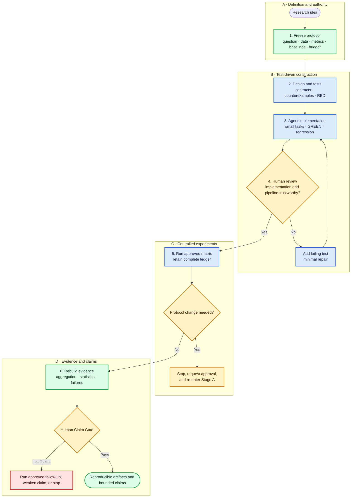

# Building Research Code with Coding Agents: A Practical Workflow

> A human–agent process from research question and implementation to experimental evidence and scientific claims

For graduate students, research programmers, research engineers, PIs, and anyone responsible for supervising coding agents in experimental work.

[中文版](#zh-cn)

---

## 0. Why research code needs a dedicated workflow

Coding agents are already strong at reading code, scaffolding projects, writing tests, debugging, and operating experiments. The main research risk, however, is rarely code that cannot run. It is code that runs while:

- implementing a subtly different question from the paper or protocol;
- changing the meaning of a split, metric, baseline, or checkpoint rule;
- using the test set during model selection;
- retaining only attractive results and losing failed runs;
- supporting a weaker conclusion than the final paper claims.

The goal should therefore not be “keep optimizing until the metric improves.” A safer division is:

> **Humans freeze the scientific question, authority, and claim boundary; agents implement, test, and operate at high speed; automated checks enforce mechanical invariants; humans approve material changes and the final claim from complete evidence.**

---

## 1. The most useful division of labor

| Coding agents are well suited to | Humans must retain |
|---|---|
| Reading papers, code, configurations, and logs | Defining the research question and success criteria |
| Turning frozen specifications into modules and interfaces | Freezing data, splits, metrics, and baselines |
| Writing tests, implementing behavior, and fixing ordinary defects | Setting search budgets, stopping rules, and test-use policy |
| Running approved baselines, ablations, and repeated experiments | Approving changes to data, models, losses, or hypotheses |
| Recording runs and drafting tables or figures | Judging fairness, statistical meaning, and paper claims |

A useful rule is:

- delegate work that is **reversible, bounded, and mechanically verifiable**;
- require human approval for decisions that change **scientific meaning, resource commitments, or publication claims**.

---

## 2. Workflow from idea to claim



The important elements are the gates, not constant human supervision. Agents can move quickly between gates. A proposed protocol change must stop the workflow and return to human approval.

### 2.1 Freeze the protocol

Before production code, define at least:

- the research question and primary hypothesis;
- data version, independent unit, and train/validation/test boundaries;
- model, loss, metrics, candidate set, and baselines;
- search space, budget, stopping rule, and checkpoint selection;
- repetitions, statistical method, and strongest permitted claim;
- actions the agent may perform automatically, only with approval, or never.

### 2.2 Design tests before implementation

Ask the agent to propose architecture, interfaces, data contracts, tensor contracts, and acceptance tests first. Critical tests should demonstrate valid failure on missing or known-wrong behavior—RED—before production implementation begins.

### 2.3 Implement through bounded tasks

Each delivery should cover one independently verifiable behavior:

1. read only the stated scope;
2. state the governing specification and unresolved ambiguity;
3. add or modify tests;
4. make the smallest implementation change;
5. run focused tests and relevant regressions;
6. report changes, evidence, remaining risks, and approval needs.

### 2.4 Run controlled experiments

Formal runs should come from a pre-approved matrix. Record at least the code commit, data version, configuration, random seed, environment, checkpoint, raw metrics, failure status, and resource use. Failed and negative runs are evidence and must not disappear silently.

### 2.5 Review the claim last

Before a result enters a paper or report, confirm that:

- planned and observed runs agree;
- aggregates can be rebuilt from lower-level records;
- comparisons use compatible information conditions and budgets;
- independent units, pairing, and sample size are correct;
- the claim does not exceed the evidence, and limitations are disclosed.

---

## 3. The four-level framework as a compact review lens

The workflow can use four quick lenses to locate risk:

| Level | Review object | Core question |
|---|---|---|
| 1 | Formulas, indices, masks, losses, gradients | Is the local algorithm implemented correctly? |
| 2 | Identity, splits, state, checkpoints, evaluation | Does the pipeline preserve experimental boundaries? |
| 3 | Baselines, budgets, statistics, and claims | Is the comparison fair and the evidence sufficient? |
| 4 | Permissions, approvals, resources, and logs | Were agent actions authorized and auditable? |

This essay intentionally does not expand each level. For the complete curriculum, failure families, validation system, and reusable Skill, see:

- [Research Code Stewardship Lab](https://github.com/heisenberg0020/research-code-stewardship-lab)
- [Project entry on the Blog](../blog.html)

---

## 4. A task contract for the agent

Avoid a prompt such as “implement this idea and optimize it.” Use a bounded contract:

```text
Objective:
  Implement one explicit, independently verifiable behavior.

Frozen rules:
  Data, splits, formulas, metrics, baselines, budget, and prohibited changes.

Allowed scope:
  Named files, modules, and configurations.

Prohibited actions:
  Do not change the scientific protocol, tune on test, expand budget,
  or delete failed runs.

Acceptance:
  Required new tests, regressions, and evidence.

Delivery:
  Change summary, fresh test results, assumptions, risks, incomplete work,
  and any decision requiring human approval.
```

If sources conflict, the agent should present evidence and alternatives rather than silently choosing an interpretation.

---

## 5. How to review an agent delivery

Efficient review does not require reading every file linearly. Use this order:

1. **Scope:** did the diff stay within the approved files and behavior?
2. **Specification:** can each non-obvious choice be traced to the paper or frozen protocol?
3. **Test quality:** can the new test actually reject a relevant wrong implementation?
4. **Local semantics:** are shapes, axes, masks, targets, losses, and gradients correct?
5. **Pipeline:** are identity, splits, caches, restored state, and evaluation order correct?
6. **Evidence:** were tests and experiments run freshly against the current commit?
7. **Scientific boundary:** did any unapproved change occur, and does the evidence support the claim?

When a defect is found, first add a test that reliably reproduces it, then make the smallest repair and rerun relevant regressions.

---

## 6. Three permission tiers

### Automatic by default

Read files, edit approved code and tests, run smoke tests, organize logs, resume approved runs, and draft result summaries.

### Approval required before change

Data cleaning or splits, model structure, loss, primary metrics, baseline conditions, search ranges, GPU budget, stopping rules, sample exclusions, and publication claims.

### Prohibited by default

Tune on the test set, overwrite source data, conceal failed runs, fabricate records, bypass approval, expand cloud resources, publish results, or approve scientific conclusions for the human owner.

---

## 7. The minimum evidence package

Even a small research project should retain:

- a one-page frozen protocol;
- code commit, environment, and data version;
- data and tensor contracts;
- automated tests and fresh results;
- a complete run ledger, including failures;
- aggregation code and raw outcomes;
- material decisions and human approvals;
- mapping from claims to specific evidence IDs.

If these artifacts cannot reconstruct the experiment, an attractive final metric is not enough to establish trust.

---

## 8. Common failure modes

- **“Keep optimizing until it improves.”** Freeze search space, budget, and stopping rules.
- **Ask the agent to build everything at once.** Use bounded tasks, small diffs, and staged gates.
- **Approve because tests pass.** Review the specification and confirm tests reject wrong behavior.
- **Retain only the best runs.** Preserve the full plan, every run, and preregistered exclusions.
- **Let one agent prove its own correctness.** Combine mechanical checks, a second review perspective, and human gates.

---

## 9. A minimal version for ordinary projects

When the full governance process is too heavy:

1. write a one-page protocol freezing data, splits, metrics, baselines, budget, and test boundaries;
2. ask the agent to write tests first and implement in small tasks;
3. review scope, specification, tests, local semantics, and pipeline after every delivery;
4. run only an approved experiment matrix and log every run;
5. independently rebuild final tables from raw records;
6. have a human approve fairness, statistics, limitations, and the final claim.

---

## 10. Final principle

Coding agents can absorb much of the engineering execution, but they cannot replace the research owner's responsibility for problem definition, experimental protocol, and scientific conclusions.

> **Use agents for speed, tests for constraints, evidence for traceability, and humans for scientific control.**
