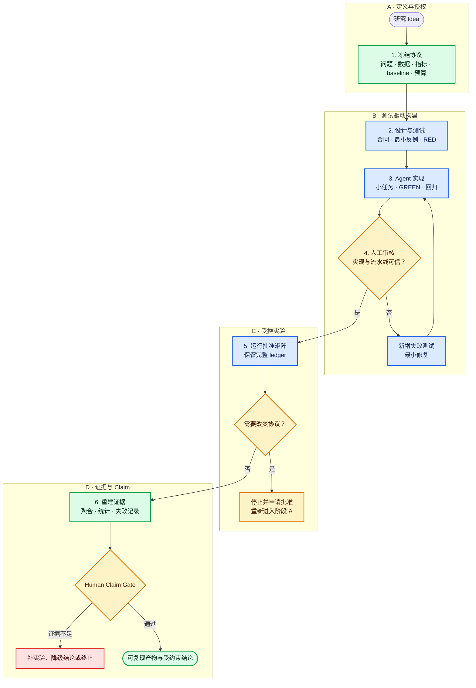

# 科研 Idea 使用 Coding Agent 构建实验代码的最佳实践

> 一套从研究问题、代码实现到实验结论的人机协作流程

适用对象：研究生、研究程序员、研究工程师、PI，以及需要监督 Coding Agent 的实验负责人。

[English version](#english)

---

## 0. 为什么需要一套专门流程

Coding Agent 已经很擅长阅读代码、搭建框架、补测试、调试和运行实验。但科研代码的核心风险通常不是“不能运行”，而是：

- 实现悄悄偏离了论文或研究问题；
- 数据切分、指标、baseline 或 checkpoint 选择改变了实验含义；
- test set 被用于调参；
- 只保留最好结果，失败运行没有进入证据链；
- 最终结论超过了实验真正支持的范围。

因此，人机协作的目标不应是让 Agent “持续优化直到指标变好”，而应是：

> **人类冻结科学问题、权限和结论边界；Agent 高速实现、测试和运行；自动检查守住机械不变量；人类根据完整证据批准关键改变与最终 Claim。**

---

## 1. 人与 Agent 的最佳分工

| Coding Agent 适合负责 | 人类必须负责 |
|---|---|
| 阅读论文、代码、配置和日志 | 定义研究问题与成功标准 |
| 把冻结规格变成模块和接口 | 冻结数据、split、指标与 baseline |
| 编写测试、实现功能、修复普通缺陷 | 决定调参预算、停止条件和 test 使用规则 |
| 运行已批准的 baseline、消融和多随机种子实验 | 批准改变数据、模型、loss 或主要假设 |
| 记录运行、生成表格和图表草稿 | 判断公平性、统计意义与论文 Claim |

一个简单判断原则是：

- **可自动验证、可逆、作用范围明确**的任务，可以交给 Agent；
- **会改变科学含义、资源承诺或最终主张**的决定，必须由人批准。

---

## 2. 从 Idea 到 Claim 的工作流



这张图的重点不是让人逐行监督 Agent，而是在少数关键位置设置 Gate。Gate 之间可以高速自动化；一旦需要改变协议，就应停止并返回人工审批。

### 2.1 冻结协议

写代码前，至少明确：

- 研究问题和主要假设；
- 数据版本、独立实验单位以及 train/validation/test 边界；
- 模型、loss、指标、候选集合和 baseline；
- 搜索空间、预算、停止规则与 checkpoint 选择；
- 重复实验、统计方法和允许声称的最强结论；
- Agent 可以自动执行、需要审批和禁止执行的动作。

### 2.2 设计测试，再开始实现

让 Agent 先输出架构、接口、数据合同、张量合同和验收测试。关键测试应先在缺失或已知错误实现上产生有效失败（RED），再开始生产实现。

### 2.3 用小任务迭代

每次只交付一个可以独立验证的行为：

1. 阅读限定范围；
2. 描述采用的规格和未解决歧义；
3. 新增或修改测试；
4. 实现最小改动；
5. 运行聚焦测试和相关回归；
6. 报告改动、证据、剩余风险与是否触及审批边界。

### 2.4 受控运行实验

正式实验应来自预先批准的运行矩阵。每个 run 至少记录代码 commit、数据版本、配置、随机种子、环境、checkpoint、原始指标、失败状态和资源消耗。失败与负结果也属于证据，不能静默删除。

### 2.5 最后审核 Claim

结果进入论文或报告前，人类应确认：

- planned runs 与实际 runs 一致；
- 聚合结果可以从底层记录独立重算；
- 比较使用相同信息条件和合理预算；
- 统计单位、配对方法和样本量正确；
- 结论没有超过证据，限制与负结果已披露。

---

## 3. 四级审计框架：只作为检查视角

这套流程可以用四个视角快速定位风险：

| Level | 检查对象 | 核心问题 |
|---|---|---|
| 1 | 公式、索引、mask、loss、梯度 | 局部算法是否实现正确？ |
| 2 | 数据身份、split、状态、checkpoint、评估 | 流水线是否保持实验边界？ |
| 3 | baseline、预算、统计与 Claim | 比较是否公平，证据是否足够？ |
| 4 | 权限、审批、资源和日志 | Agent 的行动是否获授权且可审计？ |

本文不再逐级展开。完整的四级题目、错误家族、验证方法和可迁移 Skill，请参考：

- [Research Code Stewardship Lab 项目](https://github.com/heisenberg0020/research-code-stewardship-lab)
- [Blog 中的项目入口](../blog.html)

---

## 4. 给 Agent 的任务合同

不要只说“帮我实现并优化这个 Idea”。更可靠的任务应包含：

```text
目标：
  实现一个明确、可独立验证的行为。

冻结规则：
  数据、split、公式、指标、baseline、预算和禁止改变项。

允许修改：
  指定文件、模块和配置。

禁止动作：
  不改变科学协议，不使用 test 调参，不扩大预算，不删除失败记录。

验收：
  需要新增的测试、必须运行的回归和预期证据。

交付：
  改动摘要、测试结果、假设、风险、未完成项，以及是否需要人工批准。
```

如果规格存在冲突，Agent 应先列出证据和选项，而不是自行选择一种解释。

---

## 5. Agent 写完代码后的审核顺序

高效审核不需要从第一行读到最后一行。建议按以下顺序：

1. **范围**：diff 是否只修改了批准的文件和行为；
2. **规格**：实现依据是否能指向论文、公式或冻结协议；
3. **测试质量**：新测试是否真的能击杀相关错误，而非只覆盖正确实现；
4. **局部语义**：shape、axis、mask、target、loss 和梯度是否正确；
5. **流水线**：数据身份、split、缓存、状态恢复和评估顺序是否正确；
6. **证据**：测试和实验是否刚刚运行，日志是否对应当前 commit；
7. **科学边界**：是否发生未批准的协议改变，结果是否足以支持 Claim。

发现错误后，应先写出能稳定复现问题的失败测试，再进行最小修复并重新运行回归。

---

## 6. 三档权限边界

### 默认可自动执行

读文件、写批准范围内的代码和测试、运行 smoke test、整理日志、恢复已批准实验、生成结果草稿。

### 改变前必须审批

数据清洗或 split、模型结构、loss、主要指标、baseline 条件、超参数范围、GPU 预算、停止规则、排除样本和论文主张。

### 默认禁止

使用 test set 调参、覆盖原始数据、隐藏失败实验、伪造运行记录、绕过审批、扩大云资源、发布结果或替人批准科学结论。

---

## 7. 最小证据包

即使是小型研究项目，也建议保留：

- 一页冻结协议；
- 代码 commit、环境和数据版本；
- 数据与张量合同；
- 自动测试及其最新结果；
- 完整 run ledger，包括失败运行；
- 聚合脚本和原始结果；
- 关键变更与人工审批记录；
- Claim 与具体 evidence IDs 的对应关系。

如果这些材料无法重建一次实验，那么漂亮的最终指标也不足以证明实验可信。

---

## 8. 常见失败模式

- **“持续优化直到变好”**：改为冻结搜索空间、预算和停止条件。
- **一次让 Agent 完成整个项目**：改为小任务、小 diff 和逐门验收。
- **看到测试通过就批准**：先审核规格，再确认测试能杀死错误实现。
- **只保留最好结果**：保留完整计划、所有运行和事前排除规则。
- **同一个 Agent 自证正确**：加入机械验证、第二视角审核和人工 Gate。

---

## 9. 一页式最小流程

如果完整治理流程对当前项目过重，可以先执行这个最小版本：

1. 人类写一页研究协议，冻结数据、split、指标、baseline、预算和 test 边界；
2. Agent 先写测试，再按小任务实现；
3. 每次交付检查范围、规格、测试、局部语义和流水线；
4. 正式实验只运行批准矩阵，并记录每个 run；
5. 从原始记录独立重建最终表格；
6. 人类审核公平性、统计、限制和最终 Claim。

---

## 10. 最终原则

Coding Agent 可以接管大量工程执行，但不能替代研究负责人对问题定义、实验协议和论文结论的责任。

> **让 Agent 提供速度，让测试提供约束，让证据提供可追溯性，让人类保留科学控制权。**
