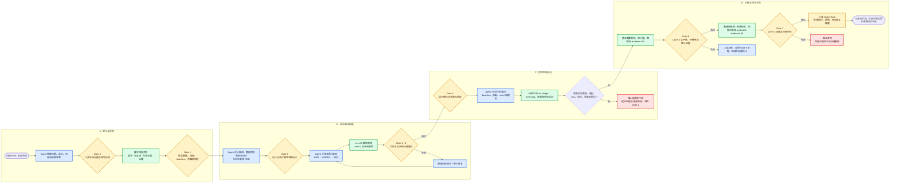

# 科研 Idea 使用 Coding Agent 构建实验代码的最佳实践

> 人机协作研究工程工作流：从研究问题、实验协议、测试驱动实现，到科学证据与最终主张审核

版本：1.0

适用对象：研究生、研究程序员、研究工程师、PI、实验负责人，以及监督 Coding Agent 的项目维护者

适用任务：机器学习、推荐系统、NLP、计算机视觉、图学习、强化学习、数据科学及其他“研究 Idea + 实验代码 + 结果主张”项目

[English version](#english)

---

## 0. 这份流程解决什么问题

Coding Agent 能显著提高代码阅读、框架搭建、模块实现、测试、调试、训练运维和结果整理的速度。但科研项目的失败，往往不是因为代码无法运行，而是因为：

- 实现的问题与原始研究问题发生了偏移；
- 公式、loss、mask、索引或梯度路径在细节上错误；
- 数据切分、样本身份、缓存或 checkpoint 破坏了实验边界；
- baseline 的信息、调参预算或停止条件不公平；
- test set 或其他受保护证据被用于模型选择；
- 失败运行、负结果或异常样本没有被完整保留；
- 最终论文主张超过了实验真正支持的范围；
- Agent 在没有批准的情况下改变了数据、模型、指标、预算或研究假设。

因此，最有效的人机协作不是：

> 人提出一个模糊 Idea → Agent 自由实现和优化 → 人只检查最终指标。

而是：

> 人冻结研究问题、科学协议、权限和验收标准；Agent 承担高带宽实现、测试与运维；机械检查持续验证不变量；人根据完整证据批准每一次科学含义发生改变的决策，并对最终主张负责。

本文把这套协作方式整理成一套可以直接用于真实科研项目的工作流。

---

## 1. 核心原则

### 1.1 Agent 负责执行带宽，人负责科学控制权

Agent 适合承担：

- 阅读论文、代码、配置、日志和数据说明；
- 把冻结规格转换成项目结构、接口和实现；
- 编写单元测试、集成测试、性质测试和回归测试；
- 运行 smoke test、baseline、消融和批准范围内的搜索；
- 监控实验、处理中断、恢复 checkpoint；
- 汇总运行记录、生成表格和图表草稿；
- 根据明确失败证据修复普通工程问题。

人必须控制：

- 研究问题、目标变量和成功标准；
- 数据版本、独立实验单位、split 和泄漏边界；
- 模型、loss、指标、baseline 和候选集合的科学定义；
- 调参预算、停止条件、checkpoint 选择和 test 使用规则；
- 哪些改变可以自动执行，哪些必须事前审批；
- 统计方法、实际意义阈值和允许的 Claim；
- 论文结论、因果解释、伦理与最终发布。

### 1.2 先冻结协议，再让 Agent 写代码

如果输入给 Agent 的只有“实现这个 Idea 并把指标做高”，Agent 就不得不替人补全大量隐含决策。它可能生成高质量代码，却实现了错误或不断变化的问题。

在第一行生产代码出现之前，至少应冻结：

1. 研究问题与主要假设；
2. 数据和独立单位；
3. 训练、验证、测试边界；
4. 主要模型与 baseline 条件；
5. loss、指标和候选集合；
6. 调参预算与停止规则；
7. 重复实验和统计分析方案；
8. 受保护证据的使用规则；
9. Agent 的权限、资源和审批边界；
10. 允许报告的最强结论。

### 1.3 测试通过不等于科学正确

测试只能证明“测试中编码的规则成立”。如果规格本身错误，测试可能稳定验证一个错误系统。

因此每个项目需要同时拥有：

- **实现测试**：代码是否满足接口、shape、数值和状态要求；
- **协议测试**：数据、评估、预算和运行过程是否遵守冻结规则；
- **科学审核**：比较是否公平、统计单位是否正确、证据是否足以支持 Claim；
- **治理审核**：改变是否获得批准，失败和负结果是否被保留。

### 1.4 所有重要结论必须可追溯

任何“实现正确”“实验完成”“方法更好”或“可以写进论文”的判断，都应能追溯到：

- 规格条款或论文位置；
- 代码、配置和 commit；
- 数据、环境和依赖版本；
- 测试名称和测试结果；
- `run_id`、随机种子和 checkpoint；
- 原始日志和运行账本；
- 聚合脚本和统计规则；
- Claim 引用的具体 evidence IDs；
- 人工审批和决策记录。

不能追溯的结果，只能视为线索，不能视为可信证据。

---

## 2. 总体流程图



这张图中最重要的不是 Agent 节点，而是多个 Gate。Agent 可以在 Gate 之间自主高效执行，但不能自行取消 Gate，也不能因为结果不好而改变 Gate 中冻结的科学规则。

---

## 3. 四层合同：审核 Agent 代码的统一框架

整个项目应同时维护四层合同。某个问题属于哪一层，以它**最先破坏的合同**为准，而不是以下游影响大小为准。

| 层级 | 合同对象 | 核心问题 | 首选证据 |
|---|---|---|---|
| Level 1 | 公式、算子、索引、mask、loss、梯度 | 局部算法是否忠实实现数学定义？ | 极小张量、性质测试、有限差分、梯度检查 |
| Level 2 | 数据身份、split、缓存、状态、checkpoint、评估 | 自动流水线是否保持身份、状态和受保护边界？ | 数据血缘、联合 fingerprint、事件顺序、独立重算 |
| Level 3 | baseline、信息条件、预算、实验单位、统计、Claim | 比较是否公平，完整证据是否支持结论？ | 计划矩阵、run ledger、配置签名、预登记统计规则 |
| Level 4 | 权限、审批、资源、停止条件、记录、受保护证据 | Agent 的行动是否被授权并可完整审计？ | 冻结协议、审批链、event log、资源和报告重建 |

### 3.1 Level 1：算法语义

人工审核重点：

- 公式中的每个符号映射到哪个 tensor；
- shape、axis、广播和 reduction 是否正确；
- padding、非法位置或未来信息是否被 mask；
- loss 接收 logits、probabilities 还是其他量；
- label、item ID、special token 和 offset 空间是否一致；
- `.detach()`、冻结参数、in-place 操作或 optimizer 参数遗漏是否切断梯度；
- train/eval 模式是否改变了算法语义。

Agent 应交付：

- 公式到代码的映射表；
- shape/axis/mask/target/loss/gradient contract；
- 极小可手算样例；
- 性质测试和梯度测试；
- 对每个非显然实现选择的证据说明。

### 3.2 Level 2：流水线完整性

人工审核重点：

- split 是否发生在正确的独立实体上，而不是扩增、窗口化之后；
- 多模态、feature、label 和 ID 是否被联合排列；
- 缓存是否绑定正确的数据版本、配置和 split；
- resume 是否恢复 optimizer、scheduler、epoch 和随机状态；
- checkpoint 是否只依据允许的 validation 证据选择；
- miss、失败或空候选是否仍保留在指标分母；
- test/protected evaluation 是否发生在模型选择之后，且未反馈到开发。

Agent 应交付：

- 数据和样本身份 manifest；
- split 与派生样本的 lineage；
- batch 前后联合 fingerprint；
- 每 epoch 的训练/验证状态；
- checkpoint 选择依据；
- 每个评估样本的记录，包括零值和失败；
- 有序事件日志。

### 3.3 Level 3：科学有效性

人工审核重点：

- baseline 是否拥有同等数据、特征、候选集合和外部信息；
- 方法之间调参次数、GPU 时间、early stopping 和人工关注是否公平；
- 失败运行和负结果是否仍在计划总体和账本中；
- 排除规则是否事前冻结；
- seed、epoch、checkpoint、window 或 crop 是否被错误当成独立科学样本；
- 配对关系和统计方法是否正确；
- 效应量、置信区间、实际意义阈值和多重比较是否被处理；
- Claim 是否超过数据集、任务、指标和实验范围。

Agent 应交付四个分离层：

1. `planned_runs`：预先冻结的完整运行总体；
2. `runs`：每次实际运行、状态、结果、纳入与排除理由；
3. `aggregate`：可从声明纳入行精确重算的聚合；
4. `claim`：范围、阈值、统计结果和精确 evidence run IDs。

### 3.4 Level 4：实验治理

人工审核重点：

- 改变发生前是否存在明确批准；
- 批准的状态、时间、scope 和资源 limits 是否覆盖实际行动；
- Agent 是否超出运行次数、时间、GPU 或 API 预算；
- 是否删除、覆盖或隐瞒失败与负结果；
- test/protected evidence 是否流入后续 adaptive action；
- 多 Agent 是否使用同一冻结协议；
- 遇到关键歧义或越界请求时是否停止并请求审批。

Agent 应交付：

- 带稳定 clause ID 的冻结协议；
- 按时间排序的 Agent event log；
- 审批状态、scope、limits 和决定时间；
- 完整 run ledger 和资源使用；
- 从 ledger 重新生成的 report manifest；
- 受保护证据到后续行动的显式引用关系。

---

## 4. 人与 Agent 的职责分工

| 工作 | Agent 可以直接执行 | 需要人工事前批准 | 只能由人最终决定 |
|---|---|---|---|
| 需求整理 | 识别歧义、生成规格草案 | 研究问题和成功标准 | Idea 是否值得研究 |
| 架构 | 提议模块、接口、目录和测试 | 数据合同和科学边界 | 系统是否代表正确问题 |
| 数据代码 | 下载、解析、清洗和缓存实现 | 数据版本、split 单位、排除规则 | 合法性、伦理与泄漏边界 |
| 模型实现 | 编写模块、forward、loss 和测试 | 主要结构、目标函数和假设 | 数学定义是否符合研究意图 |
| 调试 | 修复明确的实现和环境失败 | 会改变科学含义的修复 | 是否接受偏离原计划 |
| 实验运行 | 运行批准矩阵、恢复中断、记账 | 搜索空间、预算、停止条件 | 是否扩大实验范围 |
| checkpoint | 保存、恢复和批量评估 | 选择规则和证据角色 | 哪个模型可以进入最终测试 |
| 结果整理 | 重算、画图、生成报告草稿 | 聚合和统计规则 | 如何解释结果 |
| 论文写作 | 生成文字和表格草案 | Claim 范围 | 创新性、因果性和最终结论 |
| Agent 协作 | 分解独立读任务和测试 | 写权限、路径和共享协议 | 是否允许自主扩大行动 |

### 4.1 默认允许自动执行

在冻结规格内，通常可以允许 Agent：

- 添加或修改实现代码；
- 添加测试、类型、日志和诊断；
- 修复可由失败测试证明的普通 bug；
- 做不改变行为的重构；
- 运行批准的 smoke test 和小规模调试；
- 在批准的运行矩阵内启动、恢复和汇总实验；
- 生成不带最终科学判断的图表和报告草稿。

### 4.2 必须在改变前审批

以下变化不能只在完成后通知：

- 数据源、数据清洗、标签定义或 split；
- 样本构造、负采样、候选集合或过滤；
- 模型结构、主要 loss、优化目标或训练任务；
- baseline 输入信息、预训练资源或调参预算；
- metric、分母、聚合单位或统计方法；
- checkpoint、early stopping 或 test 使用规则；
- 搜索范围、seed 数、GPU/API/时间预算；
- 删除异常样本、失败运行或负结果；
- 因结果不理想而更换主要假设或研究问题。

### 4.3 默认禁止

- 使用最终测试结果选择模型或超参数；
- 把 test 指标反馈给后续自适应开发；
- 静默修改冻结协议；
- 覆盖原始日志、配置、checkpoint 或结果文件；
- 只保留最好的 seed、epoch 或运行；
- 删除失败、取消或负结果的记录；
- 在未经授权的目录、数据或网络范围内操作；
- 把缺少批准解释成已经批准；
- 把生成的表格直接写成因果或普遍性结论。

---

## 5. 推荐的项目产物

一个可审计的人机协作科研项目，建议至少具有以下结构：

```text
research-project/
├── README.md
├── GOVERNANCE/
│   ├── RESEARCH_SPEC.md              # 研究问题、假设、成功标准
│   ├── FROZEN_PROTOCOL.yaml          # 数据、模型、指标、预算和停止规则
│   ├── APPROVALS.jsonl               # 事前批准记录
│   ├── DECISION_LOG.md               # 人工决策、理由和替代方案
│   └── RISK_REGISTER.md              # 已知风险、未决假设、严重度
├── DESIGN/
│   ├── ARCHITECTURE.md
│   ├── PAPER_TO_CODE_MAP.md
│   ├── DATA_CONTRACT.md
│   ├── TENSOR_CONTRACT.md
│   └── ACCEPTANCE_CRITERIA.md
├── src/
├── tests/
│   ├── unit/
│   ├── properties/
│   ├── gradients/
│   ├── integration/
│   └── protocol/
├── experiments/
│   ├── planned_runs.csv
│   ├── configs/
│   ├── run_ledger.csv
│   ├── events.jsonl
│   └── raw_results/
├── analysis/
│   ├── aggregate.py
│   ├── aggregate.csv
│   ├── claims.json
│   └── figures/
├── reports/
│   ├── REPORT_MANIFEST.json
│   └── LIMITATIONS.md
└── audits/
    ├── LEVEL1_ALGORITHM.md
    ├── LEVEL2_PIPELINE.md
    ├── LEVEL3_SCIENTIFIC_VALIDITY.md
    ├── LEVEL4_GOVERNANCE.md
    └── RELEASE_CHECKLIST.md
```

不要求所有项目机械采用同样文件名，但必须能够回答：

- 研究协议在哪里；
- 谁在什么时候批准了什么；
- 哪些运行原计划应存在；
- 实际运行了什么；
- 哪些结果被纳入或排除，为什么；
- 聚合结果如何从原始运行重算；
- 每个 Claim 引用了哪些证据；
- Agent 做过哪些改变；
- 最终发布经过了哪些 Gate。

---

## 6. 八个 Gate 的详细执行流程

### Gate 0：Idea 与研究问题冻结

#### 人类输入

- 要解决的科学问题；
- 为什么现有方法不足；
- 主要假设和最小可证伪形式；
- 目标数据、任务和评价对象；
- 成功、失败和无结论分别意味着什么。

#### Agent 工作

- 把 Idea 拆成明确的研究问题；
- 列出歧义、隐含假设、替代解释和不可识别因素；
- 区分“论文主张”“工程目标”和“探索性问题”；
- 生成规格草案和风险清单；
- 明确需要人决定的选项，不擅自选择。

#### 必须产物

- `RESEARCH_SPEC.md`；
- 初始假设账本；
- 允许 Claim 的初始范围；
- 未决问题和 stop conditions。

#### 通过条件

研究问题能够被清楚地证伪；主要结果不是“指标越高越好”这种未限定目标；关键术语和研究单位已有定义。

---

### Gate 1：科学协议与 Agent 权限冻结

#### 人类必须冻结

- 数据版本、纳入/排除标准和独立单位；
- train/validation/test 或对应受保护边界；
- 模型、loss、baseline、候选集合和 metric；
- 调参空间、最大 trials、预算单位和停止条件；
- 重复次数、seed、配对结构和统计分析；
- 哪些结果是探索性、确认性或最终证据；
- Agent 可以自动做什么、改变什么必须重新批准。

#### Agent 工作

- 将自然语言协议转换为机器可读配置；
- 为每条关键规则建立稳定 clause ID；
- 检查协议内部矛盾和缺失；
- 生成审批矩阵和运行计划草案；
- 对资源、依赖、数据和权限做可行性检查。

#### 通过条件

不存在需要 Agent 在实现阶段自行猜测的重大科学决策；所有关键改变都有明确审批路径。

---

### Gate 2：架构、合同与测试设计审核

#### Agent 工作

- 生成模块边界、接口和数据流；
- 建立论文/Idea 到代码位置的映射；
- 定义 tensor、数据、状态和评估合同；
- 先编写验收测试、性质测试和最小反例；
- 运行测试并记录正确的 RED：失败应来自缺失行为，而不是语法或环境故障。

#### 人工审核

- 测试验证的是冻结协议，而不是 Agent 自己发明的替代协议；
- 每条高风险规则至少有一个便宜、明确的证明方式；
- 不会只靠完整训练判断局部正确性；
- test/protected evidence 没有被引入开发路径；
- 未覆盖假设已显式记录。

#### 通过条件

实现可以被客观验收；关键算法和流水线错误可以在小规模运行中被证伪。

---

### Gate 3：Level 1 算法实现审核

#### 推荐 TDD 循环

1. 选择一个小而明确的实现任务；
2. 写下输入、输出、shape、数学性质和梯度要求；
3. 先运行相关测试并确认 RED；
4. Agent 做最小实现；
5. 运行 focused tests；
6. 运行组合回归；
7. Agent 自审 diff、风险和未测试路径；
8. 人工核对公式和极小反例；
9. 只有证据通过才合入下一任务。

#### 强制检查

- 正常样本、边界样本、全 mask、空集合和重复值；
- integer/float target 的合法输入边界；
- 数值稳定性和 NaN/Inf；
- 对称性、不变性、单调性或守恒性质；
- 有限差分与 autograd；
- 预期更新参数和不应更新参数；
- train/eval、CPU/GPU 和 dtype 差异。

#### 通过条件

不是“loss 会下降”，而是局部数学定义已经被独立证据验证。

---

### Gate 4：Level 2 流水线审核

#### 审核顺序

1. 从原始独立实体开始追踪身份；
2. 检查 split 发生时机；
3. 追踪所有派生样本、window、augmentation 或 negative；
4. 验证 feature、label、ID 和 mask 的联合对齐；
5. 检查 cache key 和数据/config hash；
6. 模拟中断并验证 resume 等价性；
7. 追踪 checkpoint 选择证据；
8. 从逐样本记录独立重算指标；
9. 确认 protected evaluation 没有参与选择；
10. 对失败、miss 和空样本检查分母完整性。

#### 通过条件

任意最终指标都能沿 lineage 回到原始独立实体、实际 checkpoint、明确配置和完整评估总体。

---

### Gate 5：实验运行授权

在开始正式实验前，应生成冻结的 `planned_runs`，每一行至少包含：

- `run_id`；
- 方法和配置 hash；
- 数据与代码 commit；
- pair/block/independent unit；
- seed；
- 运行角色：debug、tuning、validation、final；
- 最大资源和 timeout；
- 允许读取的证据；
- 预期产物；
- 失败后的处理规则。

Agent 只能：

- 执行矩阵中的运行；
- 恢复同一运行；
- 在批准范围内重试基础设施故障；
- 记录失败并请求决策。

Agent 不能因为结果不好而：

- 增加 trials；
- 改 seed 或只保留最好 seed；
- 更换 metric；
- 扩大模型；
- 改数据或样本；
- 提前查看 final evidence；
- 删除失败行；
- 把 exploratory run 重新标记为 preregistered run。

---

### Gate 6：Level 3 科学证据审核

#### 必须独立重建

- `planned_runs` 与 `runs` 的全集一致性；
- 每种方法完整的预算和信息条件签名；
- 每个 `(pair_id, method)` 的真实独立观测数；
- 纳入和排除是否符合事前规则；
- 聚合是否从声明纳入的行精确重算；
- Claim evidence IDs 是否全部指向合法、已纳入的运行；
- 效应量、不确定性、实际意义和多重比较；
- 结论是否仅覆盖被实验支持的数据、任务和条件。

#### 人工决策

若证据不足，只能选择：

- 补跑预先允许的最小实验；
- 重新审批一个明确的新实验；
- 降低 Claim 强度；
- 报告无结论或负结果；
- 终止该研究方向。

不能通过删除不利运行或改变统计单位来“修复”结果。

---

### Gate 7：Level 4 治理与 Claim Gate

#### 治理审核

- 每个自适应行动是否有对应批准；
- 批准是否在行动之前生效；
- scope 和 limits 是否覆盖实际行为；
- 运行数、时间、GPU、API 和存储是否在预算内；
- 失败、取消和负结果是否完整保留；
- report 是否能从完整 ledger 重建；
- protected evidence 是否流入后续 adaptive action；
- 多 Agent 的子任务是否遵循同一协议。

#### 最终 Claim Gate

人类逐条批准：

- Claim 的对象和范围；
- 支持它的 run IDs；
- 描述性、预测性、稳定性、泛化性或因果性强度；
- 统计意义和实际意义；
- 已知限制、负结果和异常；
- 是否需要额外复现或外部验证；
- 代码、数据和日志是否达到发布标准。

只有通过 Claim Gate 的结论才能进入摘要、论文主表、新闻稿或公开宣传。

---

## 7. Agent 写代码时的最佳任务格式

不要给 Agent 一个无限期大任务。一个高质量实现任务应包含：

```text
任务目标：
只实现 <一个模块/行为>。

冻结依据：
- 规格条款：
- 论文公式或算法位置：
- 数据/张量合同：

允许修改：
- path/a.py
- tests/test_a.py

禁止修改：
- 数据切分
- 评价指标
- 其他模块接口
- 冻结协议和现有测试含义

验收标准：
- focused test 命令
- regression 命令
- 性质/梯度/状态要求

资源边界：
- 不联网
- 不运行完整训练
- 最大运行时间

交付要求：
1. 先说明理解和风险；
2. 先运行测试并记录 RED；
3. 做最小实现；
4. 报告 GREEN 和回归结果；
5. 列出 diff、假设、未测试路径和可能需要人工决定的问题。
```

推荐把单个任务控制在一个可独立验证的行为或 30–90 分钟的 Agent 工作量。任务过大时，测试失败无法准确定位，协议漂移也更难被发现。

---

## 8. Agent 写完代码后的审核流程

### 8.1 不接受“已完成”的自然语言声明

Agent 的完成声明必须附带：

- 实际修改文件；
- `git diff` 摘要；
- 测试命令和新鲜输出；
- 失败测试到修复的因果关系；
- 规格条款和实现位置；
- 未测试路径；
- 环境、依赖和资源变化；
- 是否触及任何需审批边界。

### 8.2 九步审核法

1. **范围审核**：是否只修改了批准文件和行为；
2. **规格审核**：实现是否对应冻结条款；
3. **局部语义审核**：公式、shape、axis、mask、loss 和梯度；
4. **流水线审核**：身份、split、对齐、状态和评估顺序；
5. **测试审核**：测试是否会在错误实现上失败，而不是只覆盖当前实现；
6. **独立重算**：指标、aggregate 和报告是否可从更底层记录重建；
7. **失败注入**：解析、缓存、resume、空样本和基础设施失败是否正确传播；
8. **回归审核**：focused、combined、重复运行和 `git diff --check`；
9. **权限审核**：是否发生协议、资源或受保护证据越界。

### 8.3 第二 Agent 可以做什么

可以让第二 Agent：

- 独立阅读规格和 diff；
- 寻找能使实现失败的最小反例；
- 检查测试盲区；
- 重算数据 lineage 或指标；
- 检查 run ledger 和报告一致性；
- 输出“发现 + 证据 + 严重度 + 建议”，而不是直接改代码。

第二 Agent 不能替代人类最终审核，因为两个 Agent 可能共享相同误解、训练分布和规格盲区。

### 8.4 修复审核发现

每个真实缺陷都应按以下顺序修复：

1. 添加一个能复现缺陷的 focused test；
2. 运行并保存 RED；
3. 做最小修复；
4. 运行 focused GREEN；
5. 运行全部相关回归；
6. 更新风险、决策和已知限制；
7. 若改变科学协议，返回 Gate 1，而不是直接合入。

---

## 9. 多 Agent 如何提高效率而不破坏一致性

### 9.1 适合并行

- 论文不同章节的证据提取；
- 仓库入口、数据流、训练和评估的独立探索；
- 单元测试、性质测试和日志分析；
- 不同实验运行的监控；
- 独立代码审查和结果重算；
- 文档、图表和复现说明草案。

### 9.2 不适合无约束并行

- 多个 Agent 同时修改同一核心文件；
- 各自解释 loss、metric 或 split；
- 各自扩大搜索空间；
- 各自决定异常运行是否删除；
- 子 Agent 直接把结果写入最终 Claim；
- 没有共享协议版本和 commit 的实验。

### 9.3 推荐组织方式

- 一个 root Agent 负责工作分解和证据汇总；
- 每个写任务只有一个明确 owner；
- 子 Agent 默认只读，只有指定路径可写；
- 所有子任务引用同一 protocol version 和 commit；
- 并行任务必须有独立输出文件，避免写冲突；
- root Agent 只汇总证据，不替人批准科学改变；
- 人类在 Gate 处统一处理冲突和批准。

---

## 10. 推荐 Prompt

### 10.1 项目启动 Prompt

```text
你将协助我把一个科研 Idea 构建成可复现、可审计的实验代码。你的职责是高质量执行和提供证据，不是自行改变科学问题。

第一阶段不要写生产代码。请先：
1. 整理研究问题、假设、目标变量和成功/失败标准；
2. 列出数据、split、模型、loss、baseline、指标、预算、统计和 Claim 中的所有歧义；
3. 把问题映射为 Level 1 算法合同、Level 2 流水线合同、Level 3 科学证据合同和 Level 4 治理合同；
4. 给出项目架构、验收测试、风险清单和需要人工决定的选项；
5. 明确允许自动执行、需要事前批准和禁止的行动；
6. 等我批准冻结协议后再实现。

任何需要改变数据、样本构造、split、模型、loss、metric、baseline 条件、搜索预算、checkpoint/test 规则、统计方法或主要 Claim 的决定，都必须先停止并请求批准。
```

### 10.2 单任务实现 Prompt

```text
只实现下面这个已批准任务，不扩大范围：

目标：
冻结规格：
允许修改：
禁止修改：
focused tests：
regression tests：
资源限制：

按 RED → 最小实现 → GREEN → 回归 → 自审执行。完成时提交：
- 修改文件和关键 diff；
- 测试命令与结果；
- 规格到代码映射；
- 最小反例或性质证明；
- 未测试假设和风险；
- 是否触及任何审批边界。
```

### 10.3 代码审核 Prompt

```text
作为独立审核者，只审核，不修改代码。

输入包括冻结规格、代码 diff、测试和运行产物。请按四层合同检查：
1. Level 1：公式、shape、axis、mask、loss、梯度；
2. Level 2：数据身份、split、对齐、状态、checkpoint、评估边界；
3. Level 3：baseline 信息与预算、实验单位、排除、统计和 Claim；
4. Level 4：权限、批准、资源、失败记录和 protected-evidence flow。

每个发现必须包含：
- 严重度；
- 精确位置或 evidence ID；
- 违反的规格条款；
- 为什么代码仍可能运行；
- 最小反例或验证命令；
- 最小安全修复；
- 若证据不足，明确写“证据不足”，不要猜测。
```

### 10.4 实验运行 Prompt

```text
只运行已批准的 planned_runs，不自行优化研究方案。

每次运行必须记录 run_id、commit、config hash、data hash、seed、开始/结束时间、资源、状态、checkpoint、指标文件和 terminal event。

基础设施失败可以在批准的重试规则内恢复；任何需要改变数据、模型、loss、metric、搜索范围、预算、停止条件或 test 使用的情况，立即停止并提交：
1. 当前证据；
2. 失败原因；
3. 最小变更提案；
4. 科学含义和预算影响；
5. 等待人工批准。

不得删除失败运行，不得只汇报最佳结果，不得让 protected evaluation 影响后续开发。
```

### 10.5 Claim 审核 Prompt

```text
根据 planned_runs、完整 run ledger、aggregate、统计规则和 claims.json，审核每条 Claim。

不要以结果看起来合理作为证据。请检查：
- evidence run IDs 是否完整合法；
- 预算和信息条件是否公平；
- 独立单位、配对和样本量是否正确；
- 排除是否预先批准；
- 聚合能否独立重算；
- 效应量、不确定性和实际意义是否支持措辞；
- Claim 是否超出数据、任务、指标和实验条件；
- 是否遗漏失败、负结果或限制。

输出：允许、降级、需补实验或阻止发布，并给出可追溯证据。最终决定仍由人类研究负责人作出。
```

---

## 11. 如何衡量人机协作是否真的高效

不要只统计“Agent 写了多少行代码”。建议记录：

| 指标 | 含义 |
|---|---|
| 从规格批准到第一个可信 smoke run 的时间 | 实现速度 |
| 首次 Gate 通过率 | 输入规格和任务拆分质量 |
| 每次变更发现的回归数 | 测试有效性 |
| 生产代码前发现的科学协议问题数 | 早期审核价值 |
| 未经批准的协议改变数 | 治理可靠性 |
| run ledger 完整率 | 实验可审计性 |
| 中断恢复等价率 | 运维质量 |
| 可独立重算的指标比例 | 证据质量 |
| Claim evidence 覆盖率 | 结论可追溯性 |
| 失败和负结果保留率 | 报告完整性 |
| 人类花在机械工作与科学决策上的时间比例 | 人机分工是否合理 |

理想状态不是人类完全退出，而是：

- Agent 承担重复、可检查、高带宽的工作；
- 自动测试承担确定性不变量检查；
- 人类时间集中在问题定义、歧义、协议、证据和 Claim；
- 高风险错误尽量在昂贵训练前被小实验发现；
- 每个最终结论都能被第三方重建。

---

## 12. 常见失败模式

### 12.1 “持续优化直到指标提高”

问题：允许 Agent 无限扩大搜索、窥视测试集或事后改变假设。

替代：冻结运行矩阵、预算、停止条件和审批边界。

### 12.2 一次让 Agent 构建整个项目

问题：无法知道哪个决策来自规格，哪个来自 Agent 补全。

替代：按合同和 Gate 拆成小任务，每次只合入一个可验证行为。

### 12.3 只审查最终 diff

问题：看不到实验过程中的越权、失败运行和 test peeking。

替代：同时审核代码、事件、审批、run ledger 和报告重建。

### 12.4 看到测试通过就批准

问题：测试可能编码了错误规则。

替代：先审规格，再审测试能否杀死错误实现，最后审生产代码。

### 12.5 让同一个 Agent 自己实现、自己证明、自己批准

问题：共享盲区会被重复确认。

替代：机械验证、独立 Agent review 和人工 Gate 三者分离。

### 12.6 只保留最好的实验

问题：形成 seed、checkpoint 和选择性报告偏差。

替代：完整 `planned_runs` 和 immutable run ledger，排除必须有事前规则。

### 12.7 把无显著差异解释为方法有效

问题：描述性数值、统计证据和实际意义被混淆。

替代：预先冻结分析单位、配对、效应量、区间和实际意义阈值。

### 12.8 把“没有记录批准”直接判为越权

问题：缺失日志不一定能正面证明没有批准。

替代：冻结完整审批集合，并用状态、时间、scope 或 limits 与行动的明确冲突证明。

---

## 13. 最小可行版与严格版

### 13.1 小型课程项目或早期探索

最低要求：

- 一页 `RESEARCH_SPEC.md`；
- 冻结数据、split、metric 和预算；
- Level 1/2 自动测试；
- 每次运行的 config、seed、commit 和结果；
- 不使用 test 做选择；
- 人工审核最终表格和 Claim。

### 13.2 论文、毕业项目或公开仓库

增加：

- 机器可读冻结协议；
- planned/observed/aggregate/claim 四层证据；
- 完整审批与决策日志；
- 多 seed、配对和统计分析；
- Level 1–4 审计报告；
- 独立 Agent 或第二人审核；
- 发布前复现和报告重建。

### 13.3 高风险、昂贵或受监管研究

进一步增加：

- 数据治理、伦理和隐私审批；
- 不可变原始数据与产物存储；
- 环境镜像和供应链审计；
- 独立统计审核；
- 外部复现；
- 权限最小化和全量行动日志；
- 预注册或正式变更控制。

---

## 14. 一页式执行清单

### Agent 开始写代码前

- [ ] 研究问题和主要假设已冻结；
- [ ] 数据、独立单位和 split 已冻结；
- [ ] 模型、loss、baseline、metric 和候选集合已冻结；
- [ ] 搜索空间、预算、停止与 checkpoint 规则已冻结；
- [ ] test/protected evidence 边界已冻结；
- [ ] 统计方法和允许 Claim 已冻结；
- [ ] Agent 自动权限、审批项和禁止项已明确；
- [ ] 架构、数据合同和 tensor contract 已审核；
- [ ] 验收测试已先运行并产生有效 RED。

### Agent 每次代码交付后

- [ ] diff 只包含批准范围；
- [ ] focused tests 新鲜通过；
- [ ] 相关回归全部通过；
- [ ] 公式、shape、mask、loss 和梯度已核对；
- [ ] 数据身份、split、状态和评估顺序已核对；
- [ ] 新测试能在错误实现上失败；
- [ ] 没有静默依赖、环境或协议变化；
- [ ] 未测试假设和风险已记录；
- [ ] 审核发现通过新 RED → 修复 → GREEN 闭环。

### 正式实验开始前

- [ ] `planned_runs` 完整；
- [ ] 配置、数据和代码均有 hash/commit；
- [ ] 每个方法预算和信息条件可比较；
- [ ] run roles 与 protected evidence 规则明确；
- [ ] 资源 limits 和重试规则获批；
- [ ] 失败和负结果保留规则明确。

### 结果进入论文前

- [ ] 运行总体与账本一致；
- [ ] 聚合可从底层结果独立重算；
- [ ] 排除符合事前规则；
- [ ] 统计单位、配对和样本量正确；
- [ ] Claim 引用精确 evidence IDs；
- [ ] 统计意义与实际意义均被校准；
- [ ] 失败、负结果和限制被披露；
- [ ] 审批、资源和 protected-evidence flow 已审计；
- [ ] 人类研究负责人完成最终 Claim Gate。

---

## 15. 最终原则

高效的人机科研协作，不是让人类逐行监视 Agent，也不是让 Agent 持续行动直到得到漂亮结果。

真正可靠的分工是：

> **人类冻结问题、合同、权限和 Claim；Agent 高速实现、测试、运行和整理；自动检查持续验证不变量；人类只在有完整证据时批准科学含义发生变化的决定。**

当代码、数据、状态、实验、审批和 Claim 都能沿一条完整证据链被重建时，Agent 的执行效率才真正转化为科研效率，而不是更快地产生不可审计的结果。

---

## 16. 与本仓库四级训练框架的关系

本文把仓库原本用于“训练人审核研究代码”的四级框架，反向应用到真实的人机协作开发过程：

- [训练仓库总览](https://github.com/heisenberg0020/research-code-stewardship-lab/blob/main/README_zh-CN.md)：Coding Agent 能力边界、程序员新角色和四级训练目标；
- [Research Code Audit Training Skill](https://github.com/heisenberg0020/research-code-stewardship-lab/blob/main/skills/research-code-audit-training/SKILL.md)：测试驱动实施、公开/隐藏验证、证据化审核和修正流程；
- [四级合同边界](https://github.com/heisenberg0020/research-code-stewardship-lab/blob/main/skills/research-code-audit-training/references/four-level-framework.md)：算法、流水线、科学有效性和治理的归类规则；
- [质量门](https://github.com/heisenberg0020/research-code-stewardship-lab/blob/main/skills/research-code-audit-training/references/quality-gates.md)：RED/GREEN、最小反例、误报控制和最终拒绝条件；
- [产物合同](https://github.com/heisenberg0020/research-code-stewardship-lab/blob/main/skills/research-code-audit-training/references/artifact-contracts.md)：manifest、run ledger、claim 和 governance artifacts；
- [Level 3/4 实施经验](https://github.com/heisenberg0020/research-code-stewardship-lab/blob/main/skills/research-code-audit-training/references/level3-level4-implementation-lessons.md)：计划、观测、聚合、Claim、审批和 evidence flow 的结构化要求。

训练框架询问“哪份实现或实验材料可信”；本文则把同样的问题提前到每个真实开发 Gate，使错误在进入昂贵实验或论文主张之前被发现。
